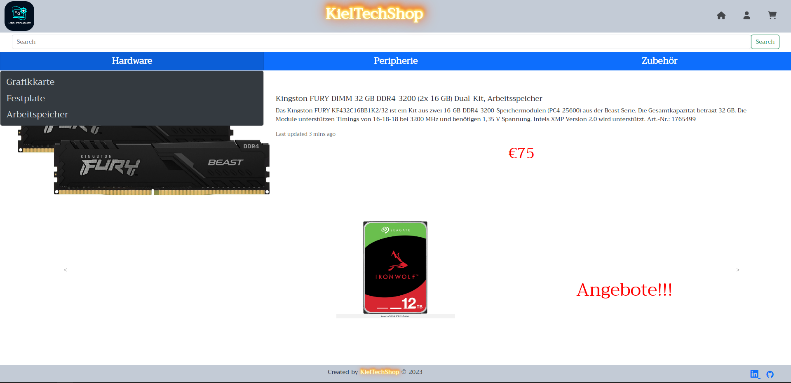
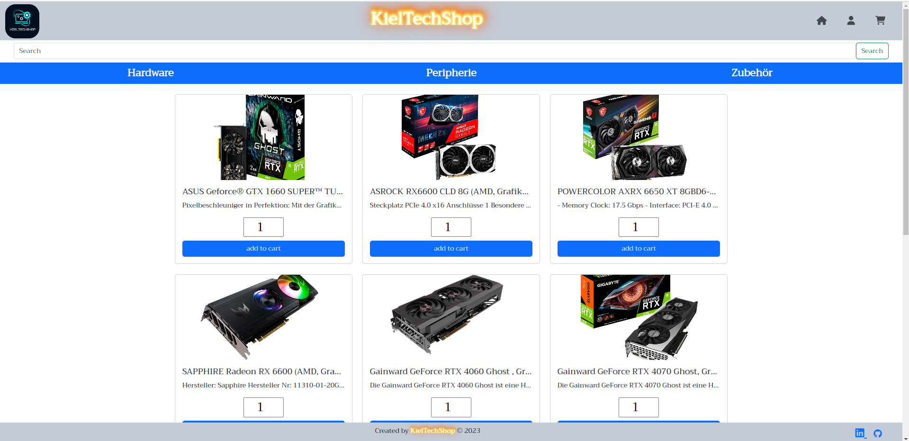
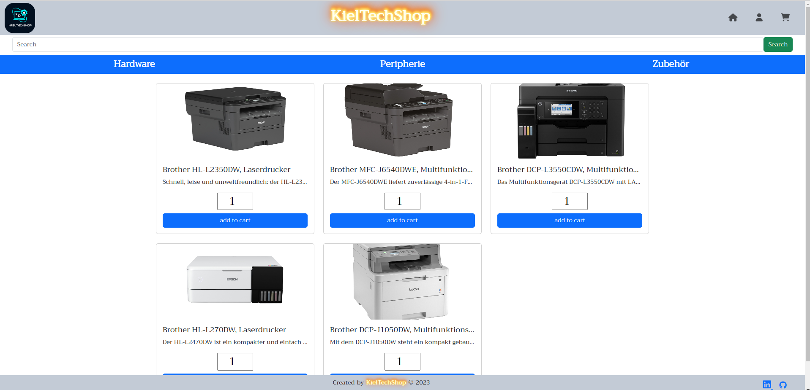
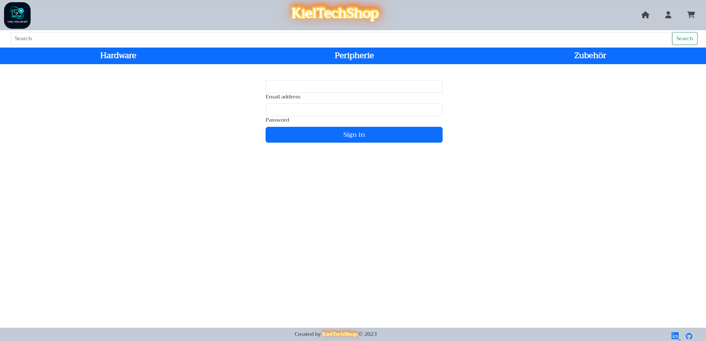
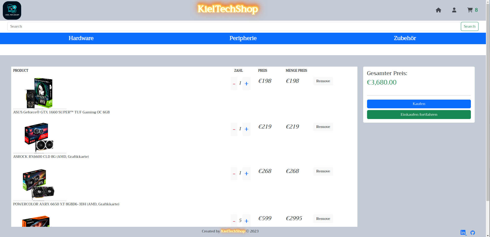
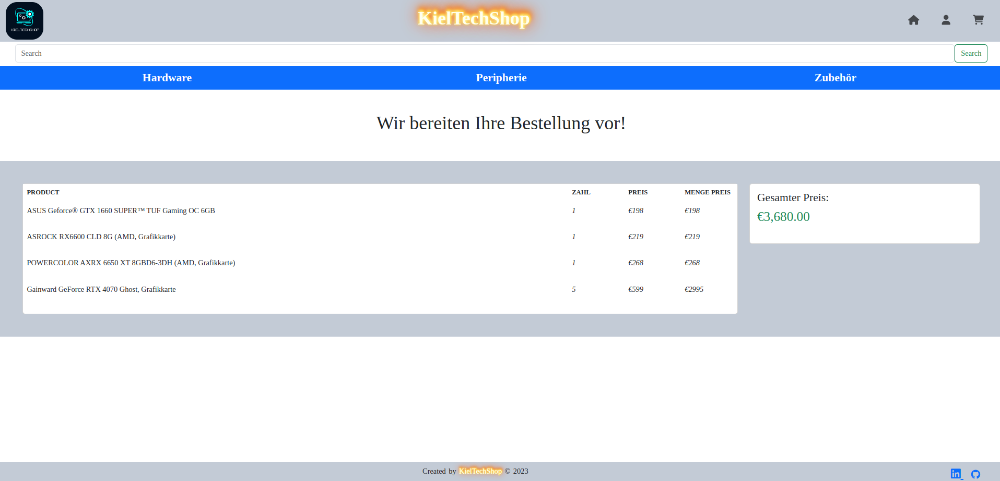
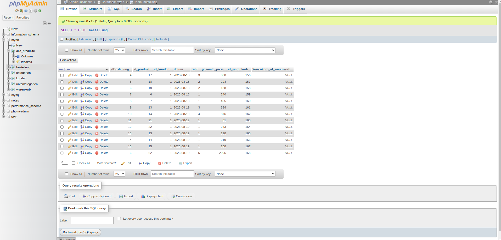
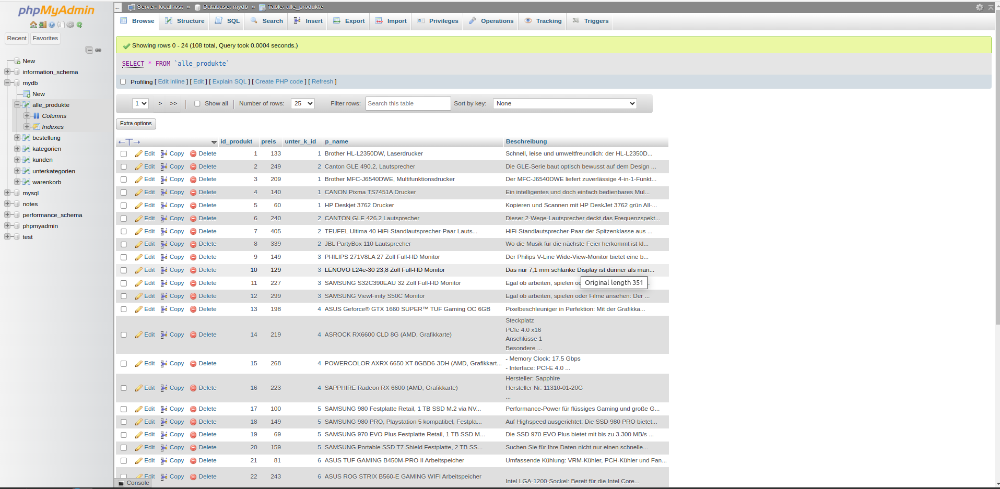

# KielTechShop E-Commerce Project

This repository contains the source code for the KielTechShop, an e-commerce website selling computer components and peripherals.

## Technologies Used

- HTML5
- CSS3
- PHP
- MySQL
- Bootstrap

## Description

KielTechShop is an online platform that offers a wide range of computer parts and accessories for tech enthusiasts and professionals. The website provides a user-friendly interface for browsing, searching, and purchasing products.

## Features

- Search functionality to find specific products.
- Shopping cart to add and manage selected items.
- User-friendly interface for product selection.
- Dynamic content rendering using PHP and MySQL.
- Responsive design with Bootstrap for a seamless experience on various devices.

## Installation and Usage

1. Clone this repository to your local machine.
2. Set up a local web server (e.g., XAMPP) and configure it to serve the project directory.
3. Import the provided MySQL database (`mydb.sql`) to your database server.
4. Update the database connection settings in the `db.php` file to match your server settings.
5. Open the website in your browser by navigating to the local server address.

## Screenshots

*Screenshot of the KielTechShop homepage.*

*Screenshot of a product page with detailed information.*

*Screenshot of a product page with detailed information.*

*Screenshot of a product page with detailed information.*

*Screenshot of a product page with detailed information.*

*Screenshot of the shopping cart displaying selected items.*

*Screenshot of a product page with detailed information.*

*Screenshot of a product page with detailed information.*

*Screenshot of a product page with detailed information.*

## Contributing

Contributions are welcome! If you find any issues or want to enhance the project, feel free to open a pull request.

## License

This project is licensed under the [MIT License](LICENSE).

---

